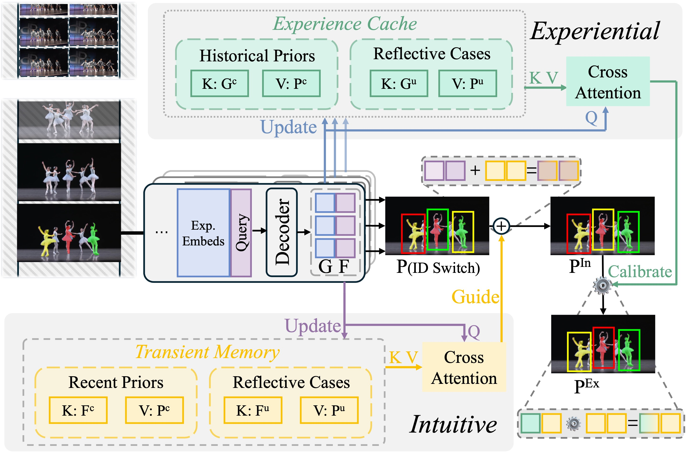

<div align="center">
  <h1>Dual-level Adaptation for Multi-Object Tracking: Building Test-Time Calibration from Experience and Intuition</h1>
</div>

<div align="center">
  Wen Guo<sup>1</sup>,&nbsp;&nbsp; Pengfei Zhao<sup>1</sup>,&nbsp;&nbsp; Zongmeng Wang<sup>2</sup>,&nbsp;&nbsp;
  Yufan Hu<sup>3</sup><sup>*</sup>,&nbsp;&nbsp; Junyu Gao<sup>4</sup><br>
  <sup>1</sup>Shandong Technology and Business University, &nbsp;&nbsp;
  <sup>2</sup>Inner Mongolia University,<br>
  <sup>3</sup>University of Science and Technology Beijing, &nbsp;&nbsp;
  <sup>4</sup>Institute of Automation, Chinese Academy of Sciences, <br>
  <sup>*</sup>Corresponding Author.
</div>


## Highlight
⭐ Our <a href="http://arxiv.org/abs/2603.21629">[paper]</a> has been accepted by CVPR2026 !
\
⭐ Our <a href="http://arxiv.org/abs/2603.21629">[paper]</a> has been uploaded to arXiv.

## Abstract
Multiple Object Tracking (MOT) has long been a fundamental task in computer vision, with broad applications in various real-world scenarios.
However, due to distribution shifts in appearance, motion pattern, and catagory between the training and testing data, model performance degrades considerably during online inference in MOT.
Test-Time Adaptation (TTA) has emerged as a promising paradigm to alleviate such distribution shifts.
However, existing TTA methods often fail to deliver satisfactory results in MOT, as they primarily focus solely on frame-level adaptation while neglecting temporal consistency and identity association across frames and videos.
Inspired by human decision-making process, this paper propose a Test-time Calibration from Experience and Intuition (TCEI) framework.
In this framework, the Intuitive system utilizes transient memory to recall recently observed objects for rapid predictions, while the Experiential system leverages the accumulated experience from prior test videos to reassess and calibrate these intuitive predictions.
Furthermore, both confident and uncertain objects during online testing are exploited as historical priors and reflective cases, respectively, enabling the model to adapt to the testing environment and alleviate performance degradation.
Extensive experiments demonstrate that the proposed TCEI framework consistently achieves superior performance across multiple benchmark datasets and significantly enhances the model's adaptability under distribution shifts.

## Overview


# Installation

Our codebase is built upon **Python 3.12, PyTorch 2.4.0 (recommended)**. 

## Setup scripts

```shell
conda create -n TCEI python=3.12		# suggest to use virtual envs
conda activate TCEI
# PyTorch:
conda install pytorch==2.4.0 torchvision==0.19.0 torchaudio==2.4.0 pytorch-cuda=12.1 -c pytorch -c nvidia
# Other dependencies:
conda install pyyaml tqdm matplotlib scipy pandas
pip install wandb accelerate einops
# Compile the Deformable Attention:
cd models/ops/
sh make.sh
# [Optional] After compiled, you can use following script to test it:
python test.py
```

## Inference

:pushpin: **Different inference behaviors are controlled by the runtime parameter `--inference-mode`.**

### Submission

You can obtain the tracking results (tracker files) using the following **template script**:

```shell
python submit_and_evaluate.py --data-root <DATADIR> --inference-mode submit --config-path <.yaml config file path> --inference-model <checkpoint path> --outputs-dir <outputs dir> --inference-dataset <dataset name> --inference-split <split name>
```

For example, you can get our default results on the DanceTrack test set as follows:

```shell
python submit_and_evaluate.py --data-root ./datasets/ --inference-mode submit --config-path ./configs/dancetrack.yaml --inference-model ./outputs/dancetrack/dancetrack.pth --outputs-dir ./outputs/dancetrack/ --inference-dataset DanceTrack --inference-split test
```

### Evaluation

You can obtain both the tracking results (tracker files) and evaluation results using the following **template script**:

```shell
python submit_and_evaluate.py --data-root <DATADIR> --inference-mode evaluate --config-path <.yaml config file path> --inference-model <checkpoint path> --outputs-dir <outputs dir> --inference-dataset <dataset name> --inference-split <split name>
```

For example, you can get the evaluation results on the DanceTrack val set as follows:

```shell
python submit_and_evaluate.py --data-root ./datasets/ --inference-mode evaluate --config-path ./configs/dancetrack.yaml --inference-model ./outputs/dancetrack/dancetrack.pth --outputs-dir ./outputs/dancetrack/ --inference-dataset DanceTrack --inference-split val
```
